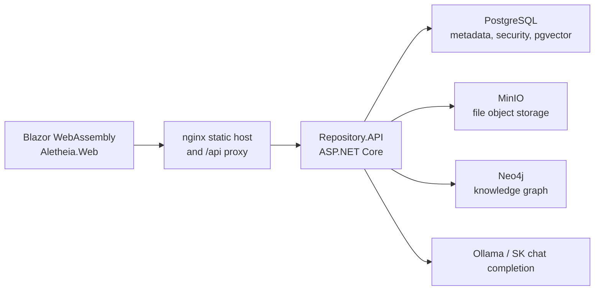
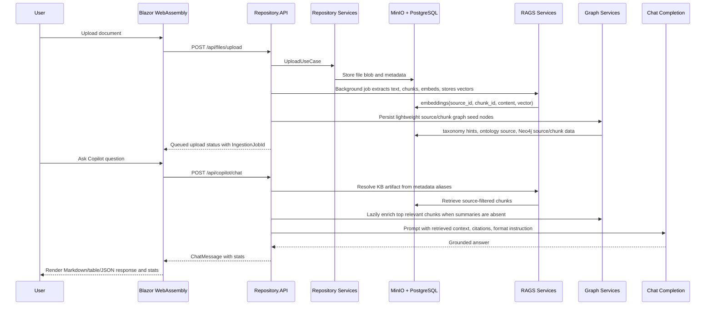

# Aletheia Technical Presentation Guide

## Purpose

This guide is written for a technical audience that needs to understand how Aletheia works end to end: command-line operation, Blazor WebAssembly, REST API, Repository, RAGS, Knowledge Graph, GraphRAG, LazyGraphRAG, and AI Copilot chat completion.

The main story is:

1. A user uploads a document.
2. Repository stores the authoritative file and metadata.
3. RAGS extracts the document text into searchable chunks and embeddings.
4. Upload indexing records searchable chunks plus lightweight graph seed nodes without forcing document-wide LLM enrichment.
5. Query-time retrieval can use semantic chunks, stored entity/community summaries, bounded lazy GraphRAG enrichment, or LazyGraphRAG's budgeted query-time traversal.
6. Copilot resolves the user's document reference, retrieves grounded context, and sends a retrieval-augmented prompt to chat completion.
7. The response is returned with citations, completion stats, and an optional output format such as summary, table, bullets, or JSON.

## System Map

| Surface | Project or service | Audience | Responsibility |
| --- | --- | --- | --- |
| Command line | `dotnet`, `docker compose`, `Aletheia.LoadTests` | Developers, operators, release engineers | Build, test, run, deploy, smoke test, load test |
| WebAssembly app | `src/Aletheia.Web` | End users, analysts, reviewers | Upload, browse, search, graph exploration, governance, Copilot chat |
| API | `src/Repository.API` | Web UI, external clients, automation | Authenticated REST entry point for repository, RAGS, graph, Copilot, governance |
| Repository | `Repository.*` | Platform services | System of record for files, metadata, versions, search metadata |
| RAGS | `RAGS.*` | Retrieval and AI services | Chunking, embeddings, vector retrieval, ontology, taxonomy, Copilot context |
| Graph | `KnowledgeGraph.*`, `RAGS.Infrastructure.Graph` | Graph services | Neo4j-backed graph nodes, edges, paths, graph administration |
| GraphRAG | `RAGS.Application.GraphRAG` | Advanced retrieval services | Typed graph indexing, summary-based retrieval, global search, context synthesis |
| LazyGraphRAG | `RAGS.Application.LazyGraphRAG` | Advanced retrieval services | TF-IDF/BM25 discovery, best-first traversal, pruning, traversal budgets |

## Runtime Topology



Default Docker Compose ports:

| Service | URL |
| --- | --- |
| Web UI | `http://localhost:8081` |
| API | `http://localhost:8080` |
| MinIO | `http://localhost:9001` |
| Neo4j Browser | `http://localhost:7474` |

## Command-Line Surface

Aletheia does not currently expose a separate product CLI executable. The command-line surface is for developers and operators:

```powershell
dotnet build Aletheia.slnx
dotnet test tests/Aletheia.Foundation.UnitTests/Aletheia.Foundation.UnitTests.csproj
dotnet test tests/Repository.UnitTests/Repository.UnitTests.csproj
dotnet test tests/RAGS.UnitTests/RAGS.UnitTests.csproj
docker compose up -d --build
```

Load testing is provided by `tests/Aletheia.LoadTests`:

```powershell
$env:API_BASE_URL = "http://localhost:8080"
$env:LOADTEST_CONCURRENCY = "10"
$env:LOADTEST_DURATION = "30"
dotnet run --project tests/Aletheia.LoadTests/Aletheia.LoadTests.csproj
```

The CLI role in a technical presentation is to show that the system is buildable, testable, deployable, and operable without relying on the browser.

## WebAssembly App

The Blazor WebAssembly app is the human experience layer. It is a static browser application served by nginx and calls the API through `RepositoryApiClient`.

Important pages:

| Page | Capability |
| --- | --- |
| Dashboard | High-level document and platform view |
| Upload | Upload document artifacts into Repository and trigger ingestion |
| Browse / Download / Metadata | Repository artifact management |
| Search Center | Standard RAGS, WRAGS, GraphRAG, and LazyGraphRAG retrieval modes, queued direct ingestion, expansion controls, retrieval strategy labels, citations, and technical error details |
| WRAGS Wiki | Durable wiki pages generated from RAGS, GraphRAG, and LazyGraphRAG knowledge, with editing, history, lifecycle status, background regeneration, stale detection, and related-page discovery |
| Graph Explorer | Graph nodes, edges, paths, and graph import |
| Taxonomy / Ontology Explorers | Knowledge classification and relationship views |
| Governance | Roles, audit logs, retention policies, PII scan |
| Copilot | RAG-augmented chat completion over registered KB artifacts, with optional plan preview, approval, background execution, progress tracking, and telemetry |

The Copilot page includes a response format selector:

| Format | Server-side meaning |
| --- | --- |
| Auto | Use configured default answer profile |
| Summary | Markdown summary with citations |
| Table | Markdown table with evidence and citations |
| Bullets | Markdown bullet list grouped by area |
| JSON | Valid JSON response shape for downstream systems |

Search Center is the quickest way to compare retrieval strategies over the same content:

- Semantic mode validates chunk/vector search.
- WRAGS mode validates durable wiki retrieval over the same knowledge estate.
- GraphRAG and LazyGraphRAG are active product modes. Demo them as graph-backed retrieval options after Semantic RAGS and WRAGS, and explain that scoped document questions still prefer Semantic RAGS evidence.
- The Activity panel should be open during ingestion demos so queued jobs, heartbeat, progress, and failures are visible.

WRAGS is the LLM Wiki surface. `/wiki` renders durable PostgreSQL-backed wiki pages with citations, version, lifecycle status, stale warnings, related topics, related pages, history, retrieval strategy, and source/chunk details. WRAGS mode searches saved pages first and uses Semantic/Vector RAG as the supported fallback. Saved WRAGS pages also participate in Search Center and Copilot retrieval context.

## API Surface

All primary platform workflows enter through `Repository.API`. Protected endpoints require JWT bearer authentication.

| Base route | Controller | Responsibility |
| --- | --- | --- |
| `/api/auth` | `AuthController` | Login, refresh, revoke, current user, user and role administration |
| `/api/files` | `FilesController` | Upload, download, delete, ingestion trigger |
| `/api/metadata` | `MetadataController` | Artifact metadata lookup |
| `/api/versions` | `VersionsController` | Version creation and listing |
| `/api/search` | `SearchController` | Repository search |
| `/api/jobs` | `JobsController` | Background ingestion job status, heartbeat, and progress snapshots |
| `/api/rags` | `RagsController` | Direct RAGS ingest and retrieve |
| `/api/copilot` | `CopilotController` | Chat, summarize, explain, discover |
| `/api/graph` | `KnowledgeGraphController` | Nodes, edges, neighbors, paths, graph import |
| `/api/graph/query` | `GraphQueryController` | Advanced graph query surface |
| `/api/graph/admin` | `GraphAdminController` | Graph administration |
| `/api/graphrag` | `GraphRagController` | GraphRAG ingest, retrieve, global search |
| `/api/lazygraphrag` | `LazyGraphRagController` | LazyGraphRAG ingest, retrieve, global search |
| `/api/ontology` | `OntologyController` | Ontology entities and relationships |
| `/api/taxonomy` | `TaxonomyController` | Categories and tags |
| `/api/governance` | `GovernanceController` | Roles, audit, retention, PII scan |
| `/api/collaboration` | `CollaborationController` | Comments, annotations, bookmarks, collections, workspaces |

## End-to-End Ingestion to Chat Completion



## Repository: System of Record

Repository owns durable document truth:

- File payloads are stored in MinIO.
- Metadata, search metadata, versions, and security data are stored in PostgreSQL.
- Repository does not own embeddings, graph data, or AI output.
- Repository exposes abstractions such as `IStorageProvider`, `IMetadataRepository`, `IVersioningService`, upload/download/delete use cases, and search use cases.

The key architectural point for a technical audience is separation of concerns: Repository answers "what document exists and where is it stored?" RAGS answers "what knowledge can be retrieved from that document?"

## RAGS: Essential Document Knowledge

RAGS is the knowledge layer for ingested Repository documents. It holds the retrieval-ready information that makes chat completion useful and source-attributable.

For each supported document, RAGS can hold:

| Data | Purpose |
| --- | --- |
| `source_id` | Stable link back to Repository file metadata |
| `source_name` / citation | Human-readable source attribution |
| Chunks | Smaller text units suitable for semantic search |
| Embeddings | Vector representation for similarity retrieval |
| Chunk index | Location hint inside the source document |
| Retrieval scores and rank | Explainable retrieval ordering |
| Taxonomy tags | Topic-oriented classification |
| Ontology entities | Domain entities extracted from content |
| Relationships | Entity-to-source and entity-to-entity context |
| `document_facts` | Normalized, page-anchored facts (due dates, budgets, page limits, vendors) extracted with a fidelity gate |

This creates the core value proposition:

- Chat answers can be grounded in registered KB artifacts.
- The model does not need to "know" the document ahead of time.
- Retrieval can be filtered to the resolved document, avoiding cross-document noise.
- Citations connect answers back to chunks and source files.
- Missing or unsupported ingestion is visible through status fields.
- Existing documents can be hydrated into RAGS on first chat miss if metadata exists but vectors are absent.

### Normalized Lexicon and Grounded Semantic Extraction (Sprint 70)

Retrieval is statistical, not semantic: vector similarity plus a whole-string ILIKE keyword fallback both fail on terse, varied-phrase facts — a document that says "Bid due: August 26, 2026" is invisible to a query that says "submission due date". The fix is a **canonical lexicon** applied on both sides of retrieval, **semantic** (an LLM understands paraphrase and novel terminology) **without losing fidelity to the source** (nothing stored that is not verifiable in the text). The design principle is **grounded semantic extraction**:

> **Propose → Verify → Normalize → Persist.** The LLM is the *recognition* layer; the source text is the *fidelity* gate; the lexicon is the *normalization* layer. No single layer carries the whole burden, and no layer is trusted alone.

- **Ingestion side**: `SemanticKernelFactProposer` proposes `{concept, value, span}` with the span quoted verbatim; `FactVerifier` drops any proposal whose span does not exist in the extracted text (whitespace-tolerant) or whose value does not parse against the concept's value pattern; `GroundedFactExtractionService` normalizes verified facts to canonical `LexiconConcept`s, anchors them to page/offset, and persists `document_facts` rows (replace-on-reingest). Best-effort — a failure never blocks ingestion.
- **Query side**: `LexiconExpander` appends a matched concept's label + full alias family to the embedding query (after acronym expansion), so "submission due date" retrieves documents that say "Bid due" or "Proposal Due Date"; the keyword fallback keeps the original query.
- **Governance loop**: concept hints that match no known concept are recorded as unmapped terms for admin review (the growth mechanism; the admin surface is a follow-up).

See `docs/Architecture.md` → "Normalized Lexicon and Grounded Semantic Extraction (Sprint 70)" for the full design.

## Copilot RAG-Augmented Chat

Copilot chat uses `SemanticKernelCopilotService` as the orchestration layer:

1. Resolve the user's source reference with `IKnowledgeSourceResolver`.
2. Use configured aliases such as `cmp -> Cleveland Metroparks`.
3. Retrieve RAGS chunks with `RetrievalRequest`.
4. If a resolved source has no chunks, use `IKnowledgeSourceIngestionService` to download the stored file, extract text, ingest into RAGS, and retry retrieval.
5. Build a prompt with retrieved context, source metadata, citations, configured focus areas, and output format.
6. Send the augmented prompt to the Semantic Kernel chat service backed by Ollama.
7. Add completion telemetry: elapsed seconds, estimated prompt/completion tokens, tokens per second, retrieved context count, citation count, retrieval scores, and heuristic alignment confidence.
8. For plan-based background executions, the engine records additional execution telemetry and a plan-versus-actual estimate comparison, shown in the progress panel and attached to the final assistant message stats.
9. Return the assistant message to the WebAssembly app.

Configuration is under `Copilot` in `src/Repository.API/appsettings.json`:

```json
{
  "Copilot": {
    "KnowledgeAliases": {
      "cmp": [ "Cleveland Metroparks" ]
    },
    "DefaultAreas": [ "scope", "requirements", "activities", "deliverables" ],
    "DefaultAnswerProfile": "rfp_requirements",
    "AnswerProfiles": {
      "rfp_requirements": {
        "OutputFormat": "Markdown with a short summary followed by a table with columns: Area, Requirement, Evidence, Citation"
      }
    }
  }
}
```

## Graph and GraphRAG

The graph layer complements vector retrieval by modeling relationships.

| Layer | What it does | Backing store |
| --- | --- | --- |
| Knowledge Graph | Stores nodes, edges, paths, graph administration data | Neo4j |
| Ontology | Maintains entities and typed relationships extracted from content | PostgreSQL and graph services |
| Taxonomy | Maintains categories, tags, and source links | PostgreSQL |
| GraphRAG | Expands retrieval through typed entities, relationships, hierarchical communities, and stored summaries | RAGS + Graph services |
| LazyGraphRAG | Performs query-time discovery, bounded best-first traversal, and subgraph pruning | RAGS + Graph services |

GraphRAG is valuable when the question depends on relationships, neighborhoods, communities, or global summaries rather than just nearby text chunks. LazyGraphRAG is valuable when query-time exploration is preferred over heavier index-time graph preparation.

### RAGS v2 Graph Intelligence

The current RAGS v2 implementation adds the following graph intelligence path:

| Capability | Implementation |
| --- | --- |
| Chunk-level extraction | GraphRAG extracts entities and relationships per chunk instead of only per document |
| Typed graph persistence | Neo4j stores `Source`, `Entity`, and `Community` nodes plus typed relationship edges such as `found_in` |
| Stored summaries | `IGraphSummaryService` and `IHierarchicalSummaryService` generate summaries for entities, relationships, documents, communities, and global context |
| Hierarchical communities | `ICommunityDetectionService` creates multi-level communities from graph structure |
| Structured context | `IGraphContextBuilder` formats graph summaries and relationships into prompt-ready context |
| Summary-based retrieval | GraphRAG prefers stored entity/community summaries and falls back to semantic chunks when needed |
| Lazy GraphRAG enrichment | When stored summaries are absent, GraphRAG can enrich the top retrieved chunks at query time, create typed nodes/edges, summarize bounded entities, mark chunks as `lazyEnriched`, and sync discoveries back to Taxonomy/Ontology |
| Global search | `IGlobalGraphSearchService` runs a map-reduce style search over top-level community summaries |
| LazyGraphRAG optimization | Lazy ingestion records text statistics only; query-time retrieval uses TF-IDF/BM25 candidates, best-first traversal, budgets, and pruning |

## Alignment with Microsoft RAG Research

In this guide, **RAGS** refers collectively to Aletheia's standard RAG, GraphRAG, and LazyGraphRAG capabilities. The implementation aligns with the major Microsoft Research themes while staying within Aletheia's .NET, Repository, and provider-abstraction architecture.

### Research Context

Microsoft's GraphRAG work highlights a limitation of baseline vector RAG: simple chunk retrieval is effective for narrow factual questions, but weaker for broad corpus-level questions such as "What are the main themes?" The Microsoft GraphRAG paper proposes building an entity knowledge graph from source documents, grouping related entities into communities, pre-generating community summaries, and using those summaries for local and global query-focused summarization.

Microsoft's LazyGraphRAG work explores a different tradeoff: reduce expensive index-time summarization and shift more reasoning to query time. The LazyGraphRAG pattern is useful when upfront graph summarization cost is too high, source data changes often, or users need a lower-cost path to graph-enabled retrieval.

### Alignment Matrix

| Research topic | Microsoft framing | Aletheia alignment | Notes |
| --- | --- | --- | --- |
| Baseline RAG | Retrieve relevant chunks from private or unseen source data before generation | `IRagsService` chunks content, creates embeddings, stores vectors in pgvector, and retrieves ranked `SearchResult` context | This is the default semantic memory layer for ingested Repository documents |
| Source attribution | Ground answers in retrieved evidence | Search results include source IDs, chunk IDs, chunk indexes, citations, ranks, and scores | Copilot prompts require citation-style answers when context is present |
| Entity graph | Build a graph index from source documents | Graph, ontology, taxonomy, and knowledge indexing services create source-linked entities and relationships | Aletheia keeps Repository as system of record and graph/RAGS as derived knowledge |
| Local graph retrieval | Use nearby entities and relationships to improve narrow-answer retrieval | GraphRAG retrieval expands from vector matches into related graph context | Useful for questions involving dependencies, relationships, or connected concepts |
| Global graph retrieval | Use community or corpus-level summaries for broad questions | GraphRAG exposes global search over top-level community summaries | Current implementation supports map-reduce style corpus-level answers |
| Lazy graph retrieval | Avoid heavy upfront summarization; discover and traverse at query time | LazyGraphRAG includes TF-IDF/BM25 query-time discovery, traversal budgets, pruning, and context construction | Matches Aletheia's need for cost-aware retrieval over changing corpora |
| Cost controls | Balance index-time cost, query-time cost, quality, and latency | LazyGraphRAG traversal budget limits depth, nodes, relationships, LLM calls, token budget, and execution time | Operationally important for local Ollama and future hosted model providers |
| Developer ergonomics | Provide accessible APIs and workflows | `/api/rags`, `/api/graphrag`, `/api/lazygraphrag`, `/api/copilot`, and WebAssembly search/Copilot views expose the patterns | Technical demos can compare modes from the same uploaded corpus |

### Aletheia RAGS Positioning

| Mode | Best fit | What Aletheia keeps | Tradeoff |
| --- | --- | --- | --- |
| Standard RAG | Direct questions over document passages | Chunks, embeddings, citations, source-filtered retrieval | Fast and simple, but less suited to global sensemaking |
| GraphRAG | Relationship-heavy or corpus-level questions | Graph nodes, relationships, summaries, expanded retrieval | Better context structure, higher index-time complexity |
| LazyGraphRAG | Dynamic corpora or cost-sensitive graph retrieval | Query-time discovery, traversal budget, pruning, context optimization | Lower upfront cost, potentially higher query-time work |

The practical message for a technical audience is that Aletheia does not treat these as competing products. They are three retrieval strategies over the same Repository-backed knowledge estate:

- Standard RAG is the semantic passage layer.
- GraphRAG is the structured relationship and summary layer.
- LazyGraphRAG is the cost-aware query-time graph layer.
- Copilot is the user-facing synthesis layer that chooses retrieved context and turns it into a cited answer.

### Possible Future Enhancements

These are candidate enhancements for a future authorized phase after the active RAGS v2 work.

| Enhancement | Why it matters | Likely impact |
| --- | --- | --- |
| Retrieval trace UI | Show which chunks, graph entities, aliases, and citations were used for a Copilot answer | Improves trust, debugging, and technical demo clarity |
| RAGS evaluation set | Add benchmark questions for RAG, GraphRAG, LazyGraphRAG, and Copilot outputs | Enables objective quality comparison between retrieval modes |
| Community-summary refresh policy | Refresh summaries when source documents change or when graph communities shift | Keeps global GraphRAG answers current |
| Hybrid lexical + vector retrieval in standard RAG | Extend BM25-style signals beyond LazyGraphRAG candidate discovery | Improves exact-term retrieval for RFP clauses, acronyms, and compliance language |
| Configurable retrieval profiles | Let admins define profiles for RFP review, compliance matrix, contract summary, technical risk, and activity extraction | Makes Copilot behavior auditable and repeatable across business domains |
| Citation drill-down | Link answer citations back to source document, chunk index, and metadata detail view | Strengthens source attribution and user confidence |
| Graph quality metrics | Track entity deduplication quality, orphan nodes, relationship density, and community coherence | Helps govern graph growth and retrieval quality |
| LazyGraphRAG budget tuning UI | Expose depth, node, relationship, token, and time budgets through admin configuration | Gives operators explicit latency/cost controls |
| Model-provider comparison | Compare local Ollama and future hosted model providers with the same RAGS context | Separates retrieval quality from model generation quality |
| Incremental ingestion queue | Extraction, embeddings, graph indexing, and summary refresh run as background jobs with `/api/jobs` progress | Improves upload responsiveness and operational resilience |

### Source References

- Microsoft Research, "From Local to Global: A Graph RAG Approach to Query-Focused Summarization" / Project GraphRAG publications: https://www.microsoft.com/en-us/research/project/graphrag/publications/
- arXiv preprint, "From Local to Global: A Graph RAG Approach to Query-Focused Summarization": https://arxiv.org/abs/2404.16130
- Microsoft Research Blog, "LazyGraphRAG: Setting a new standard for quality and cost": https://www.microsoft.com/en-us/research/blog/lazygraphrag-setting-a-new-standard-for-quality-and-cost/
- Microsoft GraphRAG project page: https://www.microsoft.com/en-us/research/project/graphrag/

## Technical Demo Flow

A strong demo for a technical audience:

1. Start the platform:

   ```powershell
   docker compose up -d --build
   docker ps
   ```

2. Validate health:

   ```powershell
   Invoke-WebRequest http://localhost:8080/health/ready
   ```

3. Open the Web UI:

   ```text
   http://localhost:8081
   ```

4. Upload a document through the Upload page.

5. Show the upload response fields:

   ```text
   IngestionStatus = Queued
   IngestionJobId = <job id>
   ```

6. Open the Activity panel and watch the background job move through extraction, chunks/embeddings, lightweight graph seed persistence, and completion.

7. Query in Search Center using Semantic and WRAGS modes.

   The current product demo validates fast Semantic/Vector RAG first, then WRAGS durable wiki retrieval, then GraphRAG and LazyGraphRAG graph-backed retrieval with Semantic fallback.

8. Open Graph Explorer and show nodes, edges, or paths.

9. Open WRAGS Wiki and search for the same topic to show durable generated wiki pages. Edit a page to show history, queue regeneration to show background work, then mark a page Reviewed, Approved, or Stale to show lifecycle controls and stale warnings.

10. Ask Copilot:

    ```text
    What requirements are defined in the last Cleveland Metroparks RFP related to activities?
    ```

    For a plan-based demo, use a prompt that triggers approval mode. The Blazor page will show the plan preview, then the progress panel, and finally the answer with a telemetry card comparing actuals to estimates.

11. Switch the Copilot format dropdown between Auto, Table, Bullets, and JSON to show that presentation format is controlled by the client while grounding remains server-side and citation-driven.

## Key Presentation Points

- Aletheia separates document recordkeeping from retrieval knowledge.
- Repository is the system of record; RAGS is the semantic memory of ingested documents.
- Graph services add relationship memory beyond vector similarity.
- Copilot is not a generic chat box; it is a retrieval-augmented interface over registered KB artifacts.
- Source resolution, lexicon/alias expansion, source-filtered retrieval, and citations are the trust path from question to answer.
- The WebAssembly app is a thin client; business logic remains in API/application services.
- The platform is provider-oriented: PostgreSQL, MinIO, Neo4j, pgvector, and Ollama are adapters behind interfaces.

## Operational Notes

- Protected API calls require JWT bearer authentication.
- Long Copilot responses may take several minutes with local Ollama; the Web UI `HttpClient` and nginx `/api` proxy are configured with 30-minute timeouts. Plan-based background execution lets the user leave the page and return later; progress is polled from durable storage.
- GraphRAG summary generation can be long-running, so file upload now queues ingestion/enrichment as a background job and returns quickly with an `IngestionJobId`.
- Poll `GET /api/jobs` or `GET /api/jobs/{jobId}` for status, stage, heartbeat, failure details, and approximate percent complete.
- `POST /api/files/upload` is the preferred ingestion path because it persists the Repository artifact and queues RAGS/knowledge indexing together.
- `POST /api/rags/ingest`, `POST /api/graphrag/ingest`, and `POST /api/lazygraphrag/ingest` remain available for direct synchronous service validation; prefer `/api/jobs/.../ingest` when validating long-running UI-like ingestion.
- Search Center direct ingestion already uses queued job APIs; a normal result is a fast queued status plus progress in the Activity panel.
- WRAGS pages are durable generated/edited snapshots in PostgreSQL; regeneration runs as a background job, updates the page version for matching topic/title/mode, records prior revisions, and clears prior review metadata. Reviewed/Approved/Stale status and linked-source stale detection are now part of the lifecycle.
- LazyGraphRAG budget limits should stop optional expansion, not fail the whole query. A visible traversal-budget failure in Search Center should be investigated as a regression.
- If chat says context is missing, verify Repository metadata, MinIO object existence, and RAGS chunks in PostgreSQL `embeddings`.
